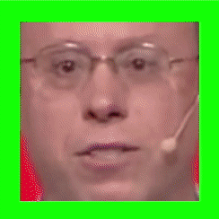

# Notes
* Add as application for the VVAD: If multiple peolple are in front of the robot, it can decide who is really speaking and focus attention on the speaker more easily

# VVAD

Developing a Visual Voice Activity Detection Framework for my Master Thesis

## List of potential links
### Papers / Books
* http://blog.qure.ai/notes/deep-learning-visualization-gradient-based-methods  - visual Evaluation

### Code
+ https://github.com/astorfi/lip-reading-deeplearning
+ https://blog.coast.ai/five-video-classification-methods-implemented-in-keras-and-tensorflow-99cad29cc0b5
+ https://machinelearningmastery.com/sequence-classification-lstm-recurrent-neural-networks-python-keras/
+ https://machinelearningmastery.com/deep-learning-models-for-human-activity-recognition/
+ https://github.com/rcmalli/keras-vggface

### DataSets
+ http://www.robots.ox.ac.uk/~vgg/data/lip_reading/
+ http://spandh.dcs.shef.ac.uk/gridcorpus/
+ http://people.csail.mit.edu/siracusa/avdata/
+ https://www.behance.net/gallery/10675283/Facial-Expression-Public-Databases (Facial expressions as backup)

### Tuning
+ https://arxiv.org/abs/1511.06422
+ https://adventuresinmachinelearning.com/improve-neural-networks-part-1/
+ https://adventuresinmachinelearning.com/stochastic-gradient-descent/

## Data Structure
video with face bounding box of the first frame + label (speaking or not speaking)

    
     
    Some samples visualized. Samples with green borders are positive samples, samples with red borders are negative samples

## Preprocessing
cut to image of face or mouth or extract features of those to give to RNN

## Pipeline
1. Facedetection -> (Lip) Features
2. Features + annotation -> Recurrent Neuronal Network(many to one or many to many?)
  * Features(or raw pixels) should be in a sliding time window(a Buffer which holds the Features from timestamp t to t-k, where t is the current time)
3. RNN -> annotation + (uncertainty?)

## For comparisons
1. Version with only lip Features
2. Version with all Face Features
3. Version with lip Image         - called End-to-End-Learning
4. Version with whole Face Image  - called End-to-End-Learning
5. May also consider Transfer Learning from a already trained Network(Should be dealing with a similar task)
6. May also use randomization(augmentation) to make the model more robust

## Open Questions
+ temporal sliding window and early classification may not be compatible...
+ temporal sliding window and RNN(LSTM) may not make too much sense(sequence is implicit in RNNs!?!)...
+ The Datasets from BBC/TED are having relatively few (or no) negative samples
  * A solution could be to take negative samples from a different dataset, which for example is for emotion classification
+ Consider using data augemtation(random changes to the images like rotations, shifts, shears, and scaling for better generalization) - this probably needs to apply in the same way to the sample(sequence of images) and not differently to single images of the sample
+ Resolution for the whole face and the lip Image can vary over time
  * Is Zooming an appropriate solution?
  * Scaling is also a Problem with the facial features
+ For Evaluation:
  * scores may not be good on a frame level, because in the start and end there may be some misclassifications -> also test if a sequence is recognized(start and end can be somehow wrong but the core should be correct)
+ Multimodal or Seamis networks to include gestures(Suggestion by Kirchner as outlook maybe)

## Commands
+ `conda env export > environment.yaml`     <->      `conda env create -f environment.yaml` or `conda env update -f environment.yaml`
+ pip install git+https://github.com/rcmalli/keras-vggface.git
 
## Slurm
*  To try on a Node with a Tesla V100: `srun -p gpu_volta --pty --gres=gpu:1 bash`
*  To start a job: `sbatch script.slr` (see onCluster.slr)
*  show jobs: `sacct --alluser`
*  cancel a job: `scancel jobID`

